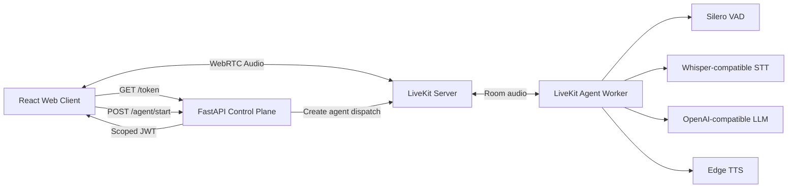

# Low-Latency Hindi Voicebot

<p align="center">
  A real-time, interruption-aware voice assistant built with LiveKit, FastAPI, React, and a modular AI speech pipeline.
</p>

<p align="center">
  <strong>Hindi-first conversation</strong> | <strong>WebRTC audio</strong> | <strong>OpenAI-compatible AI services</strong> | <strong>LiveKit agent dispatch</strong>
</p>

## Overview

This project demonstrates an end-to-end voice assistant architecture designed for natural, low-latency browser conversations. A React client joins a LiveKit room over WebRTC, a FastAPI control plane issues scoped room tokens and dispatches an agent worker, and the worker coordinates speech detection, transcription, LLM responses, and audio synthesis.

The current implementation is optimized for Hindi and bilingual Hindi/English conversations. It also includes script-normalization rules so Hindi responses remain in Devanagari before they reach text-to-speech.

## Why This Project

Real-time voice systems are more than a chatbot with a microphone. They need to manage room access, streaming audio, endpoint detection, interruptions, provider integration, and operational visibility without making the interaction feel sluggish.

This repository explores those concerns with a small, readable service layout:

- Browser-based audio transport through LiveKit WebRTC rooms
- Scoped token generation through a FastAPI API
- Explicit agent dispatch when a user joins a room
- Silero VAD tuning for responsive speech turn detection
- Whisper-compatible speech-to-text integration
- OpenAI-compatible LLM integration with configurable model endpoints
- Custom Edge TTS adapter for Hindi neural voices
- User barge-in support so the assistant can be interrupted naturally
- File-based request, transcript, state-transition, and pipeline-error logging
- Responsive React interface with connect, mute, leave, and connection-state controls

## Architecture



### Request Flow

1. The browser requests a LiveKit room token from `GET /token`.
2. FastAPI creates a participant-scoped JWT for the configured room.
3. The browser joins LiveKit and enables the participant microphone.
4. The browser calls `POST /agent/start`, which creates a LiveKit agent dispatch.
5. The worker joins the room and starts the voice pipeline.
6. Silero VAD detects speech boundaries, STT transcribes audio, the LLM produces a short conversational response, and Edge TTS streams synthesized audio back into the room.

## Technology Stack

| Layer | Technology |
| --- | --- |
| Web client | React 19, Vite, LiveKit Client SDK |
| API | FastAPI, Uvicorn, LiveKit Server SDK |
| Real-time transport | LiveKit, WebRTC |
| Voice worker | LiveKit Agents for Python |
| Voice activity detection | Silero VAD |
| Speech-to-text | Whisper-compatible API |
| Language model | OpenAI-compatible chat completions API |
| Text-to-speech | Edge TTS neural voices |
| Local infrastructure | Docker Compose |

## Repository Layout

```text
voicebot/
|-- api/                    # FastAPI control plane: health, token, and agent dispatch
|-- bot/                    # LiveKit worker, pipeline configuration, logging, and Edge TTS adapter
|-- infra/                  # Reserved for deployment-specific LiveKit and reverse-proxy config
|-- logs/                   # Local runtime logs
|-- voicebot-frontend/      # React + Vite browser client
|-- docker-compose.yml      # Local LiveKit server
`-- requirement.txt         # Python dependency manifest
```

## Local Development

### Prerequisites

- Python 3.12+
- Node.js 20+
- Docker Desktop or Docker Engine with Compose
- Access to an OpenAI-compatible LLM endpoint
- Access to a Whisper-compatible transcription endpoint

### 1. Configure Environment Variables

Copy the example environment file and replace its placeholders:

```bash
# Windows PowerShell
Copy-Item .env.example .env

# macOS or Linux
cp .env.example .env
```

The resulting `.env` file contains:

```dotenv
LIVEKIT_URL=ws://localhost:7880
LIVEKIT_API_KEY=devkey
LIVEKIT_API_SECRET=secret
LIVEKIT_ROOM=voicebot-room

LLM_BASE_URL=https://your-llm-provider.example/v1
LLM_API_KEY=replace-me
LLM_MODEL=your-chat-model

WHISPER_BASE_URL=https://your-stt-provider.example/v1
WHISPER_MODEL=your-whisper-model

TTS_VOICE=hi-IN-MadhurNeural
```

`hi-IN-MadhurNeural` is the default Hindi male voice. You can switch to another Edge TTS voice, such as `hi-IN-SwaraNeural`, through `TTS_VOICE`.

### 2. Start LiveKit

```bash
docker compose up -d livekit
```

The included Compose configuration runs LiveKit in development mode on:

- `7880`: API and WebSocket traffic
- `7881`: TCP fallback
- `7882/udp`: WebRTC media traffic

### 3. Start the API

```bash
python -m venv venv
```

```bash
# Windows
venv\Scripts\activate

# macOS or Linux
source venv/bin/activate
```

```bash
pip install -r requirement.txt
pip install fastapi uvicorn python-dotenv livekit-agents livekit-plugins-openai livekit-plugins-silero edge-tts
uvicorn api.main:app --host 0.0.0.0 --port 8001 --reload
```

### 4. Start the Agent Worker

Open another terminal with the same Python environment activated:

```bash
python -m bot.agent dev
```

### 5. Start the Web Client

```bash
cd voicebot-frontend
npm install
npm run dev
```

Open the Vite URL shown in the terminal, usually `http://localhost:5173`, enter a display name, and select **Start talking**.

## API Surface

| Method | Endpoint | Purpose |
| --- | --- | --- |
| `GET` | `/health` | Basic API liveness check |
| `GET` | `/token?name=<identity>` | Issue a room-scoped LiveKit participant token |
| `POST` | `/agent/start` | Dispatch the configured `voicebot` worker into the room |

Example health check:

```bash
curl http://localhost:8001/health
```

Expected response:

```json
{"ok":true}
```

## Configuration

| Variable | Required | Description |
| --- | --- | --- |
| `LIVEKIT_URL` | Yes | LiveKit WebSocket endpoint |
| `LIVEKIT_API_KEY` | Yes | LiveKit API key |
| `LIVEKIT_API_SECRET` | Yes | LiveKit API secret |
| `LIVEKIT_ROOM` | No | Shared room name; defaults to `voicebot-room` |
| `LLM_BASE_URL` | Yes | OpenAI-compatible LLM base URL |
| `LLM_API_KEY` | Yes | API key used for the LLM and STT client |
| `LLM_MODEL` | Yes | Chat model identifier |
| `WHISPER_BASE_URL` | Yes | Whisper-compatible API base URL |
| `WHISPER_MODEL` | Yes | Speech-to-text model identifier |
| `TTS_VOICE` | No | Edge TTS voice; defaults to `hi-IN-MadhurNeural` |

## Design Notes

### Low-Latency Conversation

The worker tunes Silero VAD thresholds and endpointing delays for quick turn-taking. `allow_interruptions=True` enables barge-in behavior, allowing a user to start speaking while the assistant is responding.

### Hindi-First Voice UX

The system prompt asks the LLM to reply in the user's language while enforcing Devanagari for Hindi. The worker also contains a normalization helper for Arabic-script output before TTS integration is finalized.

### Provider Flexibility

The STT and LLM clients are configured through base URLs and model identifiers. This keeps the orchestration layer independent of a single hosted AI vendor as long as the provider implements the expected OpenAI-compatible API.

### Operational Visibility

The API logs request lifecycle events. The worker logs room joins, participant state changes, transcripts, conversation items, generated speech, and pipeline failures into `logs/`.

## Production Hardening Checklist

This repository currently runs as a local development implementation. Before deploying it to a public environment:

- Replace development LiveKit mode with an explicit production configuration.
- Move every credential to a managed secret store and rotate any credential used during development.
- Restrict CORS origins and protect token and dispatch endpoints with application authentication.
- Validate participant identity rules and prevent duplicate agent dispatches.
- Move browser API URLs into build-time environment variables.
- Complete API and worker container images, reverse-proxy configuration, and health checks.
- Pin and consolidate Python dependencies into a reproducible lock or requirements file.
- Add automated API tests, worker integration tests, frontend lint checks, and CI.
- Ship structured logs to centralized observability tooling with metrics and alerting.
- Review the Edge TTS provider's terms, network requirements, and failure behavior for the target deployment.

## Roadmap

- Multi-room support with room-scoped agent lifecycle management
- Frontend-configurable API base URL
- Conversation metrics and latency tracing
- Retry and fallback strategies for STT, LLM, and TTS providers
- Containerized API, worker, and frontend deployment
- Authentication, rate limiting, and CI coverage

## Notes

- The frontend currently targets `http://localhost:8001` for API requests.
- `infra/livekit.yaml`, `infra/nginx.conf`, and the service Dockerfiles are placeholders for the deployment layer.
- Empty Python modules under `api/` and `bot/` are reserved for future separation of concerns.
